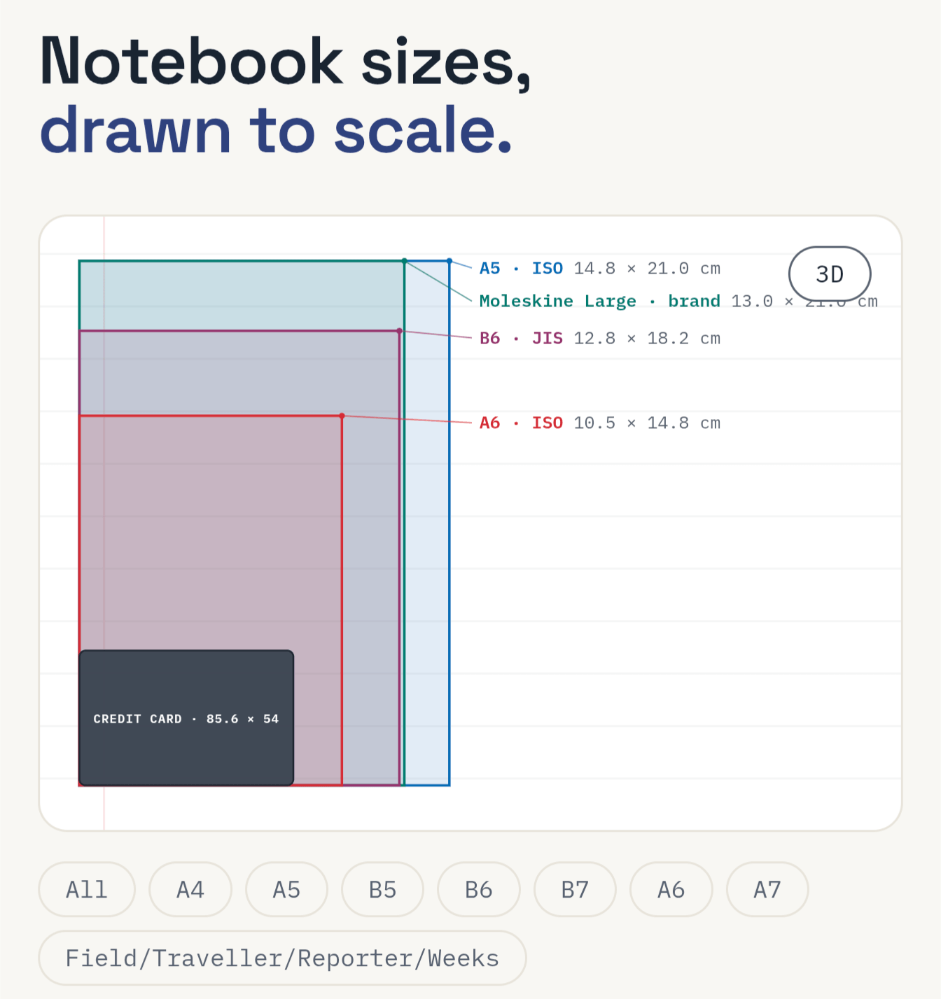
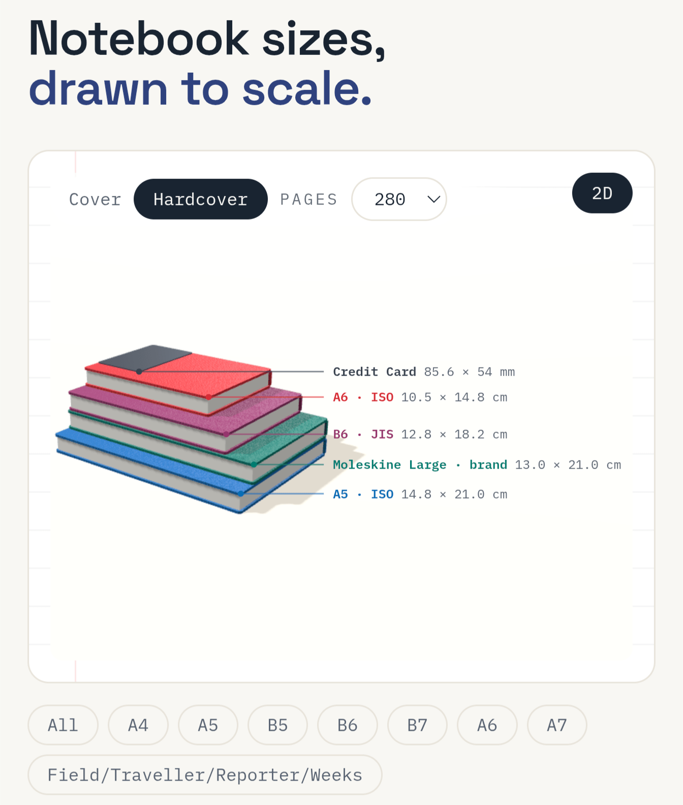

# Notebook Size Guide

Visual size guide for the most common journalling notebooks; Moleskine, Leuchtturm 1917, Hibonichi, Midori, ISO, JOS, and more! 

| 2D | 3D |
|-|-|
|  |  |

- 26+ different sizes to compare
- 3D and 2D views to get a feel for what they're really like
- Links to Amazon (non-affiliate!)
- Info on brand / standard / sizing
- Auto-detect if you prefer in or cm
- Includes popular custom brand sizes ("B6 Slim", Field Notes, etc)

_AI Disclaimer: Code written entirely by AI. This README was written by my human hands_
